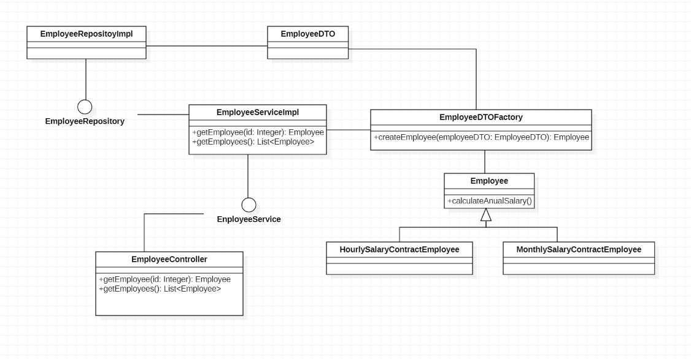

### README

These instructions allow you to get a copy of the project running on your local machine for development and testing purposes.

## Technologies

•	Maven 

•	Java 8 

## Dependencies

•	spring-web

•	Vavr

•	Junit

•	Javafaker

•	Mockito

## Run tests

•	mvn clean test.

## Build:

•	mvn clean install

## Solution design:

The following diagram shows the classes used for the implementation of the solution:

